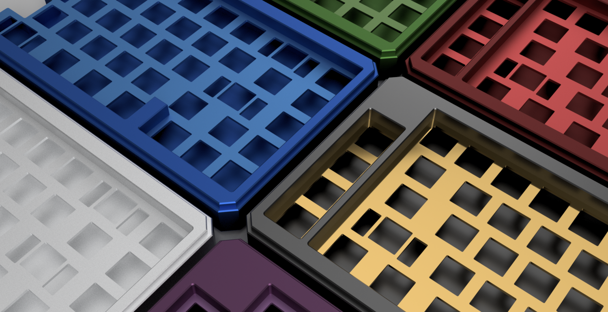
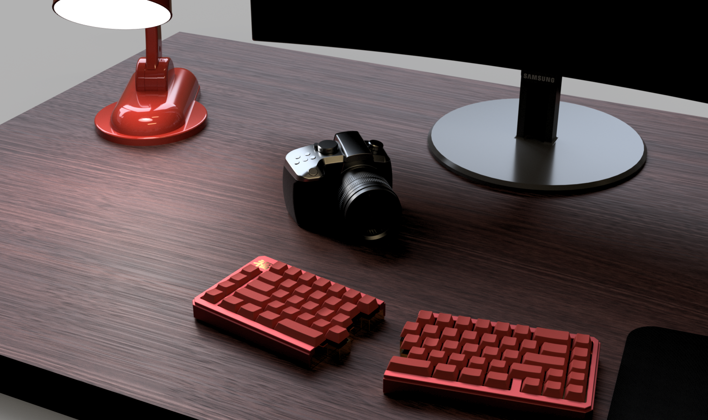
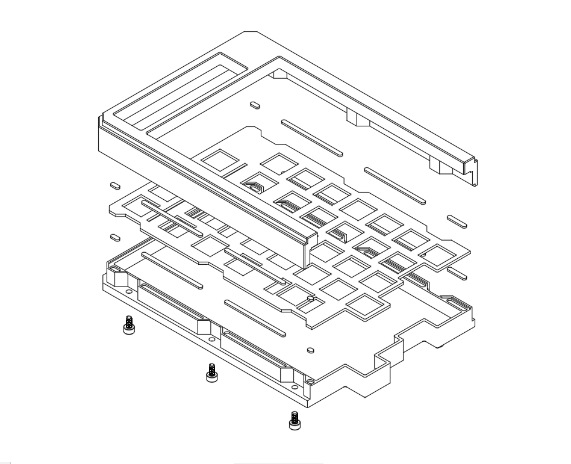

# split_65
split_65 (insert creative name here) is a split, 65% layout keyboard designed for improved ergonomics and typing comfort over extended periods of time.

<figure>
  
  <figcaption><i>maybe grey's not your taste - red and green and blue, oh my!</i></figcaption>
</figure>

It aims to remain loyal to the standard ansi layout, making the split_65 second nature to use.  The sturdy two part aluminum construction ensures that the keyboard will survive whatever torture is thrown at it over the years

<figure>
  
  <figcaption><i>feels right at home on any desk</i></figcaption>
</figure>

## technical details

<figure>
  
  <figcaption><i>I just wanted to show off an exploded view</i></figcaption>
</figure>

Possible layouts are shown below - the pcb offers stepped caps lock, tsangan, and split backspace support, and users are free to mix and match layouts as needed to suit their needs.

<figure>
  
  <figcaption><i>possible layout one</i></figcaption>
</figure>

<figure>
  
  <figcaption><i>possible layout two</i></figcaption>
</figure>
