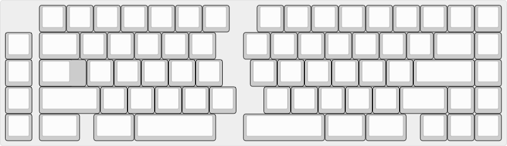

# split_65
split_65 (insert creative name here) is a split, 65% layout keyboard designed for improved ergonomics and typing comfort over extended periods of time.

<figure>
  
  <figcaption>maybe grey's not your taste - red and green and blue, oh my!</figcaption>
</figure>

It aims to remain loyal to the standard ansi layout, making the split_65 second nature to use.  The sturdy two part aluminum construction ensures that the keyboard will survive whatever torture is thrown at it over the years

<figure>
  
  <figcaption>feels right at home on any desk</figcaption>
</figure>

## technical details

<figure>
  
  <figcaption>I just wanted to show off an exploded view</figcaption>
</figure>

Possible layouts are shown below - the pcb offers stepped caps lock, tsangan, and split backspace support, and users are free to mix and match layouts as needed to suit their needs.

<figure>
  
  <figcaption>possible layout one</figcaption>
</figure>

<figure>
  
  <figcaption>possible layout two</figcaption>
</figure>

- single layout plate
- 0 degree angle
- brass logo and weight

## timeline

prototypes completed by end of q1 2019

revisions and necessary changes to be made to allow for group buy by end of q2
